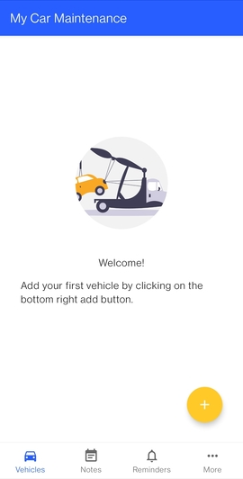

<h1 align="center"> My Car Maintenance </h1>  

  

  Keep track of your vehicle's maintenance and repairs.

<!-- START doctoc generated TOC please keep comment here to allow auto update -->
<!-- DON'T EDIT THIS SECTION, INSTEAD RE-RUN doctoc TO UPDATE -->
## Table of Contents

- [Introduction](#introduction)
- [Features](#features)
- [Feedback](#feedback)
- [Build Process](#build-process)
- [License](#license)
- [Acknowledgements](#acknowledgements)

<!-- END doctoc generated TOC please keep comment here to allow auto update -->

## Introduction

Record information about maintenance and repairs done to vehicles. Built with Kotlin, Android Jetpack libraries, Gradle and Android Studio.

**Will be available on Google Play Store soon.**

  

## Features

A few of the things you can do:

* Save details of vehicles you own
* Add service records as they happen

  
  
  
  
  

## Feedback

Feel free to send me feedback on [Twitter](https://twitter.com/PKNdegwa) or [file an issue](https://github.com/PeterKingori/My-Car-Maintenance/issues/new).

## Build Process

1. Download the repository to your computer or use Git to clone it.
2. Open the project in Android Studio.
3. Build the project using Gradle.
4. Install the app on your device or run it in an emulator.

## License

This project is licensed under the **GNU Affero General Public License**. See the full [LICENSE](https://choosealicense.com/licenses/agpl-3.0/) for details.

## Acknowledgements

<a href="https://www.flaticon.com/free-icons/tow-truck" title="tow truck icons">Tow truck icon found on Flaticon</a>

Screwdriver icon by <a href="https://freeicons.io/profile/135331">Chanut is Industries</a> on <a href="https://freeicons.io">freeicons.io</a>

                                

Copyright (c) 2022 **Peter Kingori Ndegwa**
